# OpportunityAI: Solution Definition

Named OpportunityAI as of 3 September; the Python package stays `opportunity_agent` (internal, not user-facing — not worth the rename churn across every import in the codebase). Earlier commits and working names ("Opportunity Agent," "Scholarship Scout") refer to the same project.

## 1. Executive summary

Opportunity Agent is a personal and company opportunity operations system. It continuously discovers scholarships, jobs, grants, and Zimbabwe public tenders; verifies and normalizes the source information; scores each opportunity against a maintained profile; prepares an application or bid package; and asks the owner to approve before any consequential submission.

The product should begin as an **opportunity intelligence and application-preparation assistant**, not an unrestricted autonomous applicant. Discovery and drafting can be automated. Submission, payment, legal declarations, attestations, and sending messages require explicit user approval and a visible final review.

## MVP decision

The earliest useful MVP is **Scholarship Scout**: a read-only service that discovers scholarship opportunities by generating search queries from the owner's own profile — field, certificates, work history, interests, and a narrative of their goals — rather than a hand-picked list of sites, extracts and verifies what those searches surface, matches it against the structured profile, and sends a concise digest with deadlines, fit reasons, requirements, evidence links, and missing information.

This was a deliberate revision from the original MVP shape: a curated 3–5-source list is faster to stub but puts a ceiling on the product that defeats the point — the owner would still have to know an opportunity's source existed before the system could watch it. Profile-driven discovery costs one more real dependency (a search API, below) but is the only version of this that scales the way the problem statement in §2 actually needs. `discovery.py`'s current `build_search_queries()` is on the right track (queries built from profile fields); `build_search_urls()` is not — see §6's discovery search API note before anything fetches those URLs.

The MVP deliberately does not log in to portals, submit forms, send applications, scrape LinkedIn or Indeed, process eGP bids, or fine-tune a model. It proves the highest-value uncertainty first: whether the system can find relevant opportunities and explain eligibility accurately enough that the owner trusts its shortlist.

### MVP acceptance criteria

- A scheduled run records every source checked, its retrieval time, parser status, and failures.
- Each opportunity has a canonical URL, source, publication/deadline dates, eligibility summary, requirements, and evidence excerpts or page references.
- Duplicate postings are merged without losing source evidence.
- Hard failures and unknowns are distinct from soft fit scores; an unknown requirement is never presented as eligible.
- The digest explains why an item matched, what could disqualify it, what is missing, and how soon action is required.
- The owner can correct profile facts, dismiss an item, shortlist it, and mark whether the recommendation was useful.
- No external mutation occurs: no login, upload, message, payment, or submission.

### MVP user journey

1. The owner creates a personal profile and uploads a CV or manually enters the facts that control eligibility.
2. The owner writes a detailed profile — not just structured facts but a real narrative: certificates, work history, a bio, and what they're actually trying to achieve — which the system turns into search queries instead of the owner having to name sources.
3. The collector retrieves source pages and attachments, archives evidence, and creates normalized opportunity records.
4. The extraction and matching pipeline produces `eligible`, `ineligible`, or `needs review`, plus an explainable ranking for eligible items.
5. The owner receives a digest and opens the evidence-backed detail view.
6. The owner corrects facts or labels the recommendation. Those labels improve preferences and evaluation data, but do not silently change hard eligibility rules.

The fastest path to a real MVP is to prove the discovery → matching → drafting loop on a single, low-risk vertical before adding browser automation or higher-stakes channels. **Scholarships are the first pilot**: no platform terms forbid reading public scholarship pages, the failure mode of a missed or wrong match is low-stakes compared to a bid or a flagged job-board account, and eligibility text is exactly the kind of unstructured reasoning problem the matching engine needs to prove itself against early. Jobs and Zimbabwe tenders follow once that loop is trusted — see §10.

## 2. Problem statement

A qualified individual or company misses opportunities because finding them, interpreting requirements, collecting documents, tailoring responses, completing repetitive forms, and tracking deadlines takes more time than is available. The problem is not simply lack of search. It is a fragmented, high-risk workflow involving:

- many websites, portals, email notices, PDFs, and social channels;
- requirements that are often incomplete, ambiguous, or changed after publication;
- a large set of personal and company facts and documents;
- repeated form filling and document tailoring;
- deadlines, clarification windows, mandatory meetings, fees, and submission receipts;
- high consequences for false statements, wrong attachments, missed deadlines, or unauthorized submissions.

## 3. Product goal and non-goals

### Goal

Reduce the time from opportunity publication to a verified, submission-ready package while improving fit, completeness, and deadline control.

### Non-goals for the first release

- applying to every opportunity automatically;
- bypassing CAPTCHAs, MFA, access controls, portal terms, or rate limits;
- fabricating experience, qualifications, financial information, references, or declarations;
- making legal, procurement, immigration, or employment representations without review;
- fine-tuning a model before reliable user feedback and evaluation data exist;
- scraping sites where permission, terms, robots rules, or technical constraints prohibit it.

## 4. Users and opportunity types

### Individual profile

Scholarships, fellowships, courses, grants, internships, and jobs. The profile includes education, grades, skills, work history, location, work authorization, interests, constraints, references, portfolio links, and reusable answer material — plus, critically for discovery, certificates/qualifications and a written narrative (a real bio and a statement of goals, not just tags) that the query generator in §5.1 reads to figure out what to search for in the first place. A profile that's just structured fields with no narrative gives discovery almost nothing to work with; the depth of what the owner writes here directly bounds how well the system can find things on its own.

### Company profile

Zimbabwe tenders and supplier opportunities. The profile includes legal entity details, tax and registration records, PRAZ/eGP account information, categories, certificates, directors and signatories, past performance, capacity, bank details, pricing rules, partners, and approved bid templates — plus the same kind of narrative the individual profile needs: the company's history, what it's actually capable of delivering, and its registration standing, so discovery can be pointed at tender categories that genuinely match rather than everything PRAZ publishes. Not built yet — this is Phase 4 (§10), captured here so the schema shape is known in advance.

### Initial opportunity lifecycle

`discovered -> captured -> verified -> scored -> shortlisted -> preparing -> awaiting approval -> submitted -> acknowledged -> closed`

Every transition must be timestamped and attributable to a user, connector, or agent run.

## 5. Recommended architecture

```mermaid
flowchart LR
    S[Sources: portals, websites, email, feeds] --> C[Connectors and crawlers]
    C --> N[Normalize, deduplicate, archive evidence]
    N --> X[Requirement extraction]
    P[Person and company profiles] --> M[Fit and eligibility engine]
    X --> M
    M --> W[Durable workflow and task queue]
    W --> H[Human review workspace]
    H --> D[Draft answers and package builder]
    D --> A[Approved browser/API submission]
    A --> R[Receipt, status and reminders]
    R --> L[Feedback, corrections and evaluation]
    L --> P
    L --> M
```

### Core services

1. **Source registry and connectors**
   - Two discovery modes, not one: a small **registry** (`sources.py`) for the handful of known, fixed, authoritative portals (PRAZ eGP is exactly this — one portal, not something to "search" for), and **profile-driven search** (`discovery.py`) for the open-ended long tail of scholarships, grants, and most jobs, where no fixed list could ever be complete. The registry records each source's access method, refresh frequency, allowed automation, parser version, and health status; the search path turns the owner's profile into queries against a real search API — see the discovery search API note below, not a scraped search-engine results page.
   - Prefer official APIs, feeds, email notifications, downloadable notices, and structured pages.
   - Use deterministic scrapers for known sources. Use browser automation only where necessary.
   - Store the original URL, retrieval time, page/PDF hash, and evidence excerpt for every material fact.

2. **Document and evidence pipeline**
   - Download PDFs and attachments into encrypted object storage.
   - Extract text with a PDF/OCR pipeline, preserving page references.
   - Parse into a versioned schema: title, publisher, category, geography, eligibility, documents, deadline, submission channel, fees, questions deadline, award value, and source evidence.
   - Deduplicate by canonical URL, source identifier, and content similarity.

3. **Profile and document vault**
   - Store structured facts separately from uploaded files.
   - Give every fact a provenance, confidence, expiry date, and approval status.
   - Select documents by explicit rules such as document type, validity, issuer, and opportunity requirement.
   - Never let the model invent a missing value. Mark it as `missing` or ask the user.

4. **Matching engine**
   - Apply hard eligibility rules first: citizenship, location, qualification, dates, supplier category, registration, turnover, and mandatory certificates.
   - Then rank using explainable soft signals: skills, experience, sector, preferences, deadline feasibility, and estimated effort.
   - Show matched, failed, unknown, and user-confirmation-needed criteria separately. A high score must not override a failed mandatory rule.

5. **Workflow orchestration**
   - Represent each opportunity as a durable state machine with retries, timeouts, checkpoints, and human interrupts.
   - Keep discovery, preparation, and submission as separate permissions.
   - Create tasks for missing evidence, approvals, signatures, clarifications, fees, and final submission.

6. **Application and bid executor**
   - Use APIs where available; use Playwright-based browser automation for portals that require a browser.
   - Prefer deterministic selectors and site-specific adapters. Use an AI browser agent for page interpretation and recovery, not as the sole source of truth.
   - Pause for CAPTCHA, MFA, payment, e-signature, legal declaration, or any material uncertainty.
   - Capture screenshots, submitted field values, uploaded file hashes, timestamps, and the portal confirmation/receipt.

7. **Review workspace and notifications**
   - Inbox of opportunities with fit explanation, deadline, evidence, missing requirements, effort estimate, and risk flags.
   - Draft review showing every generated answer with its supporting profile facts and source documents.
   - Approve, reject, request changes, or defer. Notify through email initially; add other channels later.

8. **Learning and evaluation**
   - Record user actions: accepted, rejected, corrected, edited, submitted, and outcome.
   - Learn preferences and ranking weights from feedback first. Keep a deterministic rule layer above any learned ranking.
   - Evaluate extraction accuracy, eligibility precision/recall, deadline accuracy, package completeness, and successful portal completion on a fixed test set.
   - Consider fine-tuning only after enough reviewed examples exist and retrieval/rules/prompts have been demonstrated insufficient.

### MVP implementation shape

Keep the first deployment as one small service with clear internal modules rather than prematurely splitting into microservices:

- **API and review UI:** FastAPI with a simple server-rendered or lightweight web frontend.
- **Database:** PostgreSQL for profiles, opportunities, evidence metadata, decisions, and audit events; use pgvector only if semantic retrieval proves useful after rule-based matching.
- **Jobs:** a database-backed scheduled worker for source checks, parsing, matching, and digest delivery. A full workflow engine can be introduced when preparation and approvals become long-running.
- **Files:** encrypted object storage for CVs and source attachments, with malware scanning and retention rules.
- **Extraction:** deterministic HTML parsing plus PDF text extraction/OCR. Use an LLM only to structure prose into a schema and cite the source passage.
- **Matching:** hard eligibility rules first, then embeddings or an LLM-assisted relevance score as a secondary ranking signal.
- **Notifications:** email digest first. Add WhatsApp/Telegram only after the core digest is reliable and the preferred channel is confirmed.

This shape minimizes setup and operational cost while keeping the data model compatible with later LangGraph workflows and browser adapters.

## 6. Open-source building blocks

| Need | Candidate | Use in this project | Important caveat |
|---|---|---|---|
| Crawling and extraction | [Crawlee](https://github.com/apify/crawlee) | TypeScript HTTP/browser crawlers, queues, retries, storage, Playwright integration | Scraping permission and source-specific limits still apply; anti-bot features are not permission to bypass controls. Apache-2.0. |
| Browser agent | [Browser Use](https://github.com/browser-use/browser-use) | Controlled form navigation and assisted completion where deterministic adapters are unavailable | LLM actions can be nondeterministic. MIT; self-hosted operation is preferable for sensitive data. |
| Browser workflow alternative | [Skyvern](https://github.com/Skyvern-AI/skyvern) | Self-hosted visual browser workflows worth evaluating for a later supervised adapter | AGPL-3.0; review network-use and deployment obligations before adopting. |
| Browser agent SDK | [Stagehand](https://github.com/browserbase/stagehand) | `observe`, `act`, and structured `extract` on top of Playwright-style control | Its strongest hosted path uses Browserbase; evaluate self-hosting, data residency, and cost. MIT. |
| Browser infrastructure | [Steel Browser](https://github.com/steel-dev/steel-browser) | Self-hosted browser sessions, cookies, screenshots, debugging, and session lifecycle | Adds infrastructure and credential risk. Apache-2.0. |
| Durable workflows | [LangGraph](https://github.com/langchain-ai/langgraph) | Checkpointed workflows, memory, retries, and human-in-the-loop interrupts | Low-level framework; application policies and audit records remain our responsibility. MIT. |
| Board discovery reference | [python-jobspy](https://github.com/cullenwatson/JobSpy) | Research reference for public job-board aggregation if the job channel is later approved | Do not use it as permission to scrape prohibited platforms; validate current source behavior and terms before adoption. |
| Integrations and schedules | [n8n](https://github.com/n8n-io/n8n) | Optional email triggers, notifications, scheduled jobs, and simple external integrations | Source-available Sustainable Use License is not equivalent to a permissive open-source license; confirm intended deployment and redistribution. |
| UI and API | FastAPI plus a web frontend | Profile, opportunity inbox, review, approvals, audit and status | Build the approval and evidence model in our code rather than hiding it inside an agent framework. |
| Job-board discovery | [python-jobspy](https://github.com/speedyapply/JobSpy) | Aggregates LinkedIn, Indeed, Glassdoor, Google, and ZipRecruiter public search results into one normalized feed for the jobs track (Phase 3) | Reads public listings only — never logs into your account, so it stays outside job-board bot-detection entirely. MIT. |
| Browser agent (alternative) | [Skyvern](https://github.com/skyvern-ai/skyvern) | Vision + LLM browser agent, self-hostable, with a workflow builder; already used in production for government-form and job-application automation | Scores 85.8% on the WebVoyager benchmark vs. Browser Use's 89.1% — evaluate both against the target portal's actual pages before choosing. AGPL-3.0, which is more restrictive to redistribute than the MIT tools above. |

### Discovery search API — a real, currently-live dependency

`discovery.py`'s `build_search_urls()` currently constructs literal `google.com/search?q=...` URLs. **Do not build a fetcher against these.** Scraping Google's own results page violates Google's terms the same way §8 rules out scraping LinkedIn, and practically it returns a JS-rendered page a plain HTTP client can't parse without a full headless browser fighting CAPTCHAs. This isn't a hypothetical: as of this writing there is no good free path left here —

- **Bing Web Search API** was retired by Microsoft on 11 August 2025; no new keys are issued.
- **Google Custom Search JSON API** is closed to new signups and is being fully shut down 1 January 2027 — not worth building against for a new project.
- Self-hosted **SearXNG** (open source, no key, no quota) is the honest free option, but as of mid-2026 its upstream engines increasingly CAPTCHA a single self-hosted IP — Google/Brave/Startpage frequently come back suspended or unparseable, leaving only DuckDuckGo reliable. Fine as a zero-cost fallback, not a foundation.
- **Tavily** and **Brave Search API** are the two realistic options: both are current, both have a usable free tier for one profile's query volume (a handful of queries per run, well under either's monthly cap), and Tavily specifically returns clean extracted snippets rather than raw SERP HTML, which drops straight into the extraction step in §5.2. Recommendation: **Tavily first**, Brave as the alternative if its independent index or pricing fits better once volume is known.

This needs a decision and an API key from the owner before `discovery.py` can be wired to anything live — see §12.

### Recommendation

Use **Python + FastAPI + PostgreSQL + object storage** for the MVP, with a small scheduled worker and deterministic scholarship connectors. Add pgvector and LangGraph only when the evaluation results justify them. Later, use Crawlee or a Python equivalent for collection and Playwright for deterministic browser adapters; evaluate Browser Use or Skyvern for narrow, supervised tasks. Add n8n only at the integration edge if it reduces work without becoming the system of record.

Deliberately **not** using [Jobs_Applier_AI_Agent / AIHawk](https://github.com/feder-cr/Jobs_Applier_AI_Agent_AIHawk) as a base, despite it being the best-known reference implementation: it drives automation directly through the user's own logged-in LinkedIn session, which is exactly the pattern §8 rules out. It's worth reading for its resume-tailoring prompts, not for its execution model.

## 7. Zimbabwe eGP track

PRAZ describes eGP as a secure web-based platform for interactions between procuring entities and bidders. The official PRAZ site reports broad rollout and links to the eGP system and support resources: [PRAZ](https://www.praz.org.zw/) and [eGP](https://egp.praz.org.zw/).

Concretely, e-bidding on the live system already requires: supplier login and e-registration under PRAZ's secure key-pair management system; adding a tender from the bulletin board and choosing an individual or joint-venture response; then filling and **encrypting** the eligibility, technical, and financial bid templates separately before submission; and paying a bid fee before the response is accepted. A third party (an Apify actor indexing `egp.praz.org.zw`) already scrapes the public bulletin board successfully, which is useful as a reference schema for tender IDs, entities, dates, and fees — but it says nothing about PRAZ's own automation terms, and the encrypted, key-signed submission step is not something to automate speculatively.

The eGP adapter must be treated as a regulated, high-risk connector:

- confirm supplier registration, user roles, categories, certificates, and account prerequisites;
- identify which notices and documents are publicly accessible versus authenticated;
- obtain written permission or use official exports/APIs where possible;
- model clarification deadlines, compulsory site visits, bid security, fees, currencies, validity periods, and submission rules;
- validate every required attachment, file type, size, signature, and expiry before opening the portal;
- require a named authorized person to approve declarations, price schedules, and final submission;
- save the official acknowledgement and submission timestamp;
- contact PRAZ/eGP support when portal behavior or automation permission is unclear.

Do not infer that an opportunity is safely submittable from a public notice alone. Tender rules and portal behavior are authoritative.

## 8. Email and professional social accounts

### Email

Start read-only. Use OAuth with least-privilege scopes, search only relevant folders/labels, and store message IDs plus extracted evidence rather than copying an entire mailbox. Sending email should be a separate permission requiring preview and approval.

### Professional socials

Use official APIs and permitted exports where available. Treat LinkedIn and similar platforms as profile/context sources, not scraping targets. Do not automate connection requests, endorsements, mass messaging, or actions that may violate platform rules. A first version can accept a manually uploaded profile export or curated links.

This is not a theoretical caution: LinkedIn's terms explicitly forbid scraping and bot use, scraping public LinkedIn data was itself the subject of the multi-year *hiQ Labs v. LinkedIn* federal case, and LinkedIn now detects "human-impossible application velocity" (100+ applications/hour) and suspends accounts even when each individual application looks legitimate. Any job-board automation (Phase 3) must discover through public listing aggregation — e.g. JobSpy, §6 — that never authenticates as the user, and must keep final submission a human click until an official, ToS-compliant apply API is used instead.

## 9. Security, privacy, and governance

- Encrypt secrets and documents at rest; use a managed secret store rather than environment files in production.
- Separate personal and company tenants, profiles, documents, and permissions.
- Use short-lived OAuth tokens, refresh-token rotation, MFA, session isolation, and explicit connector scopes.
- Redact sensitive values from logs and LLM traces.
- Treat web pages, PDFs, emails, and tender documents as untrusted input; defend against prompt injection and malicious attachments.
- Add malware scanning, file-type validation, size limits, and safe document rendering.
- Maintain immutable audit events for generated content, user edits, approvals, uploads, and submissions.
- Define retention and deletion controls for identity, financial, tax, academic, and employment documents.
- Provide export, correction, revocation, and account deletion workflows.

## 10. Phased delivery

The sequencing below is deliberately front-loaded toward one thing: get a trustworthy discovery → matching → drafting loop running for scholarships, with zero browser automation, before any submission or higher-risk channel is touched. That loop — not the browser agent — is where nearly all of the actual time saving lives, and it's buildable with no CAPTCHA, MFA, session, or ToS exposure at all.

### MVP: the scholarship inbox (target: weeks, not months)

Single vertical (scholarships), single user profile, discovery driven by that profile rather than a fixed list.

- Profile onboarding for one person: education, grades, skills, work history, certificates, a written bio and goals narrative, constraints, reusable answer material; documents uploaded manually into the vault (transcripts, ID, certificates, reference letters).
- Query generation from the profile (`discovery.py`) against a real search API (Tavily/Brave — §6), not a hand-picked source list and not a scraped Google results page.
- Read-only ingestion: fetch pages/PDFs, extract into the versioned schema (§5.2), deduplicate.
- Matching engine: hard eligibility rules first, then explainable ranking (§5.4) — this is the part worth getting right before anything else, since a wrong "yes" here wastes review time and a wrong "no" hides a real opportunity.
- For each shortlisted match: a **drafted, submission-ready package** — tailored CV/cover-letter or essay draft, a requirement checklist, and every generated claim linked back to a profile fact or source document — landing in the review workspace with a deadline reminder.
- No browser automation, no API submission, no company/tender profile yet. Output is a reviewed package you personally submit. This is the full value of §2's problem statement (discovery + triage + drafting) without any of §3's non-goal risk.

This alone directly answers the original complaint — missing applications from lack of time — for the lowest-risk vertical, and produces the labeled evaluation data (accepted/rejected/corrected matches) that every later phase depends on.

### Phase 2: supervised scholarship submission

Once the MVP's matching precision and draft quality are trusted on real opportunities: add one scholarship-portal browser adapter, session isolation, an explicit approval checkpoint before any click that submits, receipt capture, and replayable run history. Still scholarships only.

### Phase 3: jobs track

Add job-board discovery via JobSpy (public listings, no login — §6, §8). Reuse the same matching and drafting pipeline. Submission stays assisted (agent drafts and pre-fills, you click submit) until an official, ToS-compliant apply path justifies more automation — never drive it through your authenticated session.

### Phase 4: company profile and eGP pilot

Stand up the company profile (§4) and PRAZ/eGP account prerequisites. Start with monitoring and package preparation only, using the encrypted-template mechanics in §7 as the spec, not a guess. Add assisted upload, then user-confirmed, key-signed submission by a named authorized signatory — never unattended, given §7's stakes.

### Phase 5: learning and scale

Use reviewed outcomes across all verticals to improve ranking, source prioritization, document reuse, and effort estimates. Add more connectors only after each connector has health checks, tests, and a clear owner. Fine-tuning, per §3's non-goals, stays off the table until this evaluation data actually shows retrieval/rules/prompts are insufficient.

## 11. Success metrics

- Opportunity extraction field accuracy, especially deadline and eligibility.
- Precision of the top-ranked shortlist and percentage of recommendations the user accepts.
- Percentage of shortlisted opportunities with complete requirement checklists.
- Time from discovery to submission-ready package.
- Zero unauthorized submissions and zero fabricated claims.
- Portal submission success rate, receipt capture rate, and recoverable failure rate.
- Percentage of generated statements traceable to an approved fact or source.
- User corrections per application and outcome feedback quality.

## 12. Decisions to make before implementation

Resolved:

1. ~~Which individual opportunity type is the first pilot: jobs or scholarships?~~ → **Scholarships**, for the reasons in §1.

Resolved:

1b. ~~Search API provider for `discovery.py`.~~ → **Tavily**. Client built (`search.py`, commit `7ab06cd`) and tested against Tavily's documented contract, using `httpx.MockTransport` — no live key needed for the suite. Still needed from the owner: an actual `TAVILY_API_KEY` (sign up at tavily.com) once someone wires `discovery.py`'s query strings through `search.search()` instead of `build_search_urls()`'s literal Google URLs.

MVP-blocking — needed before Phase 1 build starts:

2. The owner's actual detailed profile write-up: certificates, work history, a real bio, and a goals narrative — this is what discovery's query generation runs on, so a thin profile means thin discovery regardless of which search API is wired in.
3. Which documents may be uploaded automatically into the vault, and which always require manual selection.
4. Is the first deployment local/self-hosted, a private server, or cloud-hosted in an approved jurisdiction?
5. Which email provider and OAuth scopes are acceptable for read-only ingestion?

Deferred — needed before Phase 3/4, not before MVP:

6. Which company tender category and one known eGP workflow is the pilot?
7. What counts as approval for a final application, bid price, declaration, payment, and email send?
8. Which job-board and scholarship-site terms explicitly permit collection, beyond the public-listing default in §6/§8?
9. Who is legally authorized to submit bids and sign declarations for the company?

## 13. Bottom line

The strongest implementation is a **human-governed opportunity operating system** assembled from proven open-source components. Its defensible value is not a generic browser agent. It is the verified profile, evidence-linked matching, document and deadline controls, connector-specific reliability, approval policy, and complete audit trail. Build those foundations before attempting broad autonomous applications or model fine-tuning.

Ship that value narrowly first: the scholarship-only, no-browser-automation MVP in §10 proves the profile, matching, and drafting foundations against real deadlines within weeks, using only tools that carry no platform or legal exposure. Everything riskier — submission automation, job boards, and Zimbabwe tenders — is a deliberate, later addition on top of a loop that has already earned trust, not a parallel build.

## 14. Accounts, multi-profile documents, and containerization (Phase 2)

Direct request, decided 3 September: multi-tenant accounts (email sign-in, separate logins for different people — not just a personal access gate), an uploaded-document vault backed by MinIO, and three curated profile types per account (scholarship / job / grant) the owner can create any subset of and customize independently. Document *extraction* (pulling work history out of an uploaded CV automatically) is explicitly deferred to an open-source LLM (Ollama, evaluate at that time) — build the upload/storage pipeline now without it.

This is a real architectural fork from the MVP, not an addition to it: the MVP's `store.py` holds exactly one global profile and one global opportunity list, no user concept at all. Multi-tenancy means every one of those needs owner scoping. To avoid breaking the MVP loop that's already live-verified and in use, this phase is built as new, independently-tested infrastructure first (accounts, data model, document storage), with **migrating `/discover`, `/matches`, `/digest`, and `/ui` to be account-scoped as an explicit, separate, later step** — not bundled into the same change as introducing auth.

### Data model

Moving off the single JSON file to PostgreSQL — multi-tenant relational data (accounts owning several profiles, each profile owning several documents) is what relational structure is for, and it's also what makes the Docker/microservices split in §14.4 coherent (a database is a natural separate container; a JSON file on a volume is not).

- **Account**: id, email (unique), password hash, created_at. Password auth, not magic-link — avoids a second new external dependency (SMTP) on top of the document/auth work; email-based notifications (§14.3) are a separate later decision once a provider is chosen.
- **Profile**: id, account_id, profile_type (`scholarship` | `job` | `grant`), display_name, and the existing `PersonalProfile` fields (name, country, age, study_level, field, documents, interests, goals, history, achievements, preferred_countries, preferred_funding, certificates, work_history) plus a picture URL. An account can hold zero to three Profiles, one per type, freely switchable — not one record with type-tagged field overrides, since the owner's framing was explicit that each type gets its *own* fully separate data, sharing only account-level identity (email, picture).
- **Document**: id, profile_id, MinIO object key, original filename, content type, size, uploaded_at, extraction_status (`pending` | `extracted` | `skipped` — `skipped` is the only reachable state until Ollama extraction lands). A CV uploaded under the Job profile and one uploaded under the Scholarship profile are distinct Documents even if the same file, because they belong to different Profiles — matches "documents per profile."
- **Notification**: id, account_id, kind, message, read_at, created_at. In-app first (surfaced in the existing review UI as a notification list/bell) — no new external dependency required today; email as a channel is a fast-follow once a provider is chosen, same shape of decision as Tavily was for search.

### Document vault (MinIO)

Self-hosted, S3-compatible, runs as its own container (§14.4) — the right fit for "the system scrapes the documents and takes relevant data... stores the documents per profile... retrieves and sends them when applying." Upload flow: owner attaches a file under a specific Profile → validated (type/size) → written to MinIO under a key namespaced by account/profile/document id → metadata row created. Retrieval for an application package (§5, drafting.py) reads the Document rows for the active Profile and generates short-lived presigned URLs rather than exposing MinIO directly or proxying full file bytes through the API.

### Profile onboarding flow

Sign in (or register) → redirect to profile setup → owner picks which of the three profile types to create (at least one) → per profile: fill fields, upload documents, review what came back once extraction exists, correct or explicitly suppress any field the system filled in that they don't want disclosed (a `visible: bool` per sensitive field is simpler to reason about than deleting the underlying value — the fact stays for matching, the disclosure choice stays separate, consistent with §5.3's "never invent, never silently drop a known fact"). Owner can add/edit/switch between profiles at any time after onboarding, not just once.

### Docker / microservices

`docker-compose.yml` with four services: `api` (this FastAPI app), `worker` (same codebase, different entrypoint — runs scheduled discovery and, later, document extraction jobs, so a slow `/discover` call doesn't block the request-handling process), `db` (Postgres), `minio` (object storage + its console). No message queue (Celery/Redis) in this pass — that's real added complexity or a genuine next step once `worker` needs to run more than a scheduled job; noted here so it isn't silently assumed to already exist.

### What this explicitly does not do yet

- Does not migrate the existing scholarship discovery/matching/digest endpoints to be account-scoped — they remain the single-tenant MVP flow until that migration is deliberately scoped and built.
- Does not implement document extraction (needs the Ollama evaluation the owner asked to defer).
- Does not implement email notifications (needs a provider decision, deferred like Tavily was).
- Does not implement a task queue for `worker` — a scheduled/cron job runner is sufficient for what's actually being built now.
